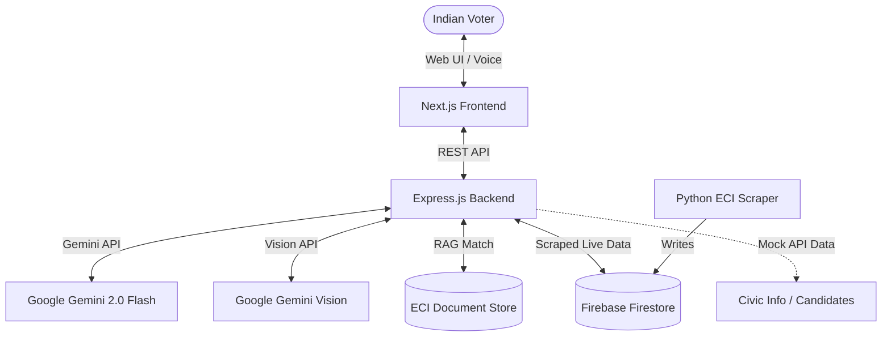

# High-Level Design (HLD)

## 1. System Context

MatdataMitra serves as the intermediary between Indian Voters and the Election Commission of India's (ECI) complex data repositories.

## 2. Component Architecture

### Client Layer (Next.js)
- **ChatBot & HomeSearch Components:** Manage the UI state for text input and voice interactions.
- **Media Controller:** Interfaces with the browser's `SpeechRecognition` and `SpeechSynthesis` APIs.
- **State Management:** React Hooks (`useState`, `useEffect`) bound to Firebase `onAuthChange` listeners.

### Application Layer (Express.js)
- **`chat.routes.ts`:** Handles the translation and routing of queries to the AI engine.
- **`gemini.service.ts`:** Manages the system prompt, JSON mode generation (Quiz, Journey), and Vision SDK interactions (Document Verifier, OCR) with Google Gen AI.
- **`rag.service.ts`:** Executes semantic or exact-match search against curated documents.
- **`candidate.service.ts`:** Serves mock external data for the KYC module and parses PDF uploads.

### Data Layer
- **Knowledge Base (`sampleDocs`):** JSON array of predefined text blocks simulating a vector database.
- **Mock Stores:** Candidate and Voter datasets simulating external databases.
- **Firestore DB:** Live database storing real-time scraped announcements from the ECI portal and acting as a local RAG cache.

## 3. Data Flow: End-to-End Chat Request

1. **Client Action:** User types "What is SRC?" and hits submit.
2. **API Request:** Frontend issues `POST /api/chat` with `{ "message": "What is SRC?", "language": "en" }`.
3. **Intent Parsing:** Backend requests Gemini to classify the intent (`general_query`).
4. **RAG Extraction:** Backend executes `buildAugmentedPrompt` which identifies the `docs/src-ssr-revision.txt` payload.
5. **Generation:** Backend sends the System Prompt, RAG Context, and User Message to Gemini 2.0 Flash.
6. **API Response:** Backend returns the synthesized response to the frontend.
7. **Client Render:** Frontend renders the text and optionally initiates `SpeechSynthesis` to speak the answer.
